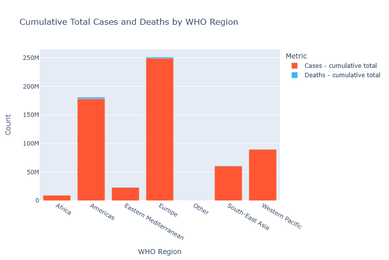
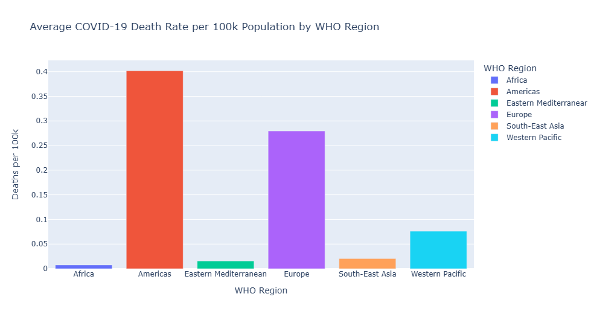
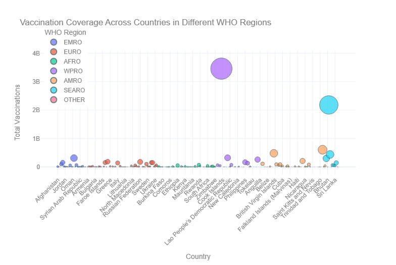
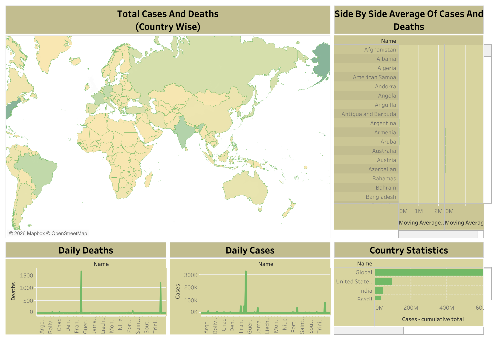

# 📊 Global COVID-19 Data Visualization (WHO Data)

## 🔍 Overview
This project analyzes global COVID-19 trends using data from the World Health Organization (WHO). It focuses on understanding the distribution of cases, deaths, and vaccination coverage across different regions and countries.

## 📁 Dataset
- WHO COVID-19 Global Data
- WHO Vaccination Data

## 🎯 Objectives
- Compare cumulative COVID-19 cases and deaths across WHO regions
- Analyze death rates per 100,000 population
- Evaluate vaccination coverage across countries and regions

## 🛠️ Tools & Technologies
- Python
- Pandas
- Matplotlib
- Seaborn
- Plotly (interactive visualizations)
- Tableau (dashboard visualization)

## 📊 Key Visualizations
- Bar charts comparing cases and deaths by region
- Death rate analysis per 100k population
- Scatter plot of vaccination coverage across countries
- Interactive dashboards (Tableau)

## 📈 Key Insights
- The Americas and Europe show significantly higher cumulative cases and deaths compared to other regions
- Death rates per 100k population vary widely, highlighting differences in healthcare systems and reporting
- Vaccination coverage is highly uneven across countries, with developed regions showing higher full vaccination rates

## 📷 Sample Visuals
## 📊 Regional Cases vs Deaths

## 📉 Death Rate per 100k

## 💉 Vaccination Coverage

## 📊 Tableau Dashboard

## ▶️ How to Run
1. Install dependencies:
   pip install -r requirements.txt

2. Run notebook or script:
   jupyter notebook

## 📌 Project Structure
- report.pdf → Detailed analysis
- notebook.ipynb → Code and visualizations
- tableau/ → Tableau dashboards
- images/ → Graph outputs

## 🚀 Future Improvements
- Add time-series analysis
- Build interactive dashboard using Streamlit
- Integrate real-time data updates